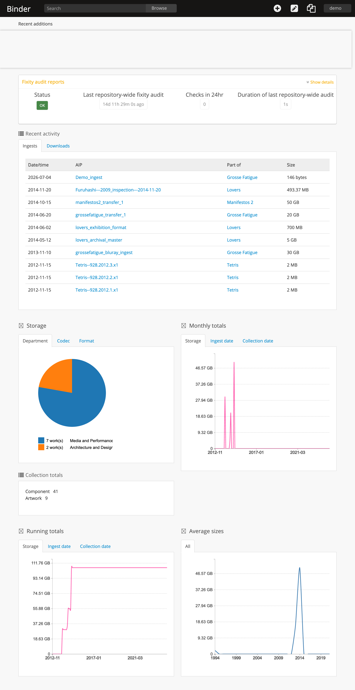
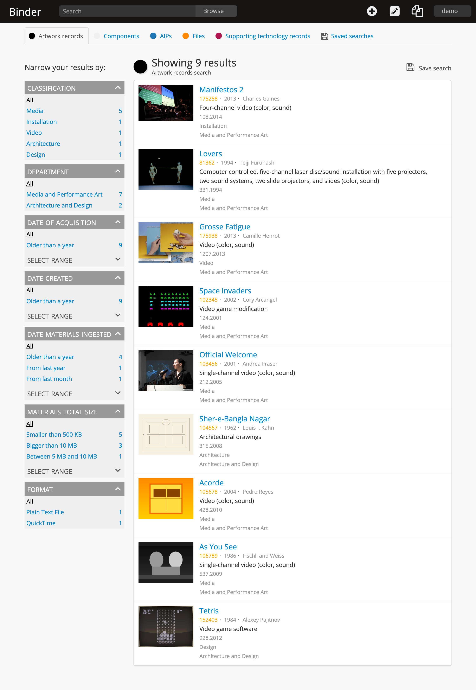
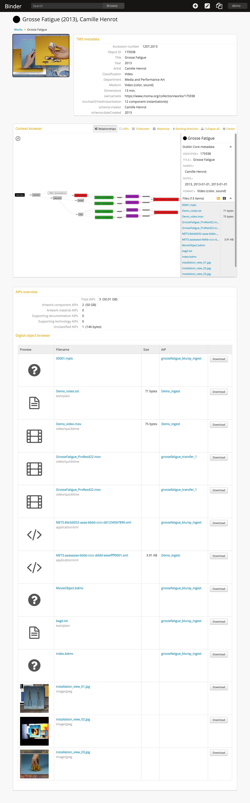

# Binder (binder-classic) — 원본 Binder 부활 스파이크 · Phase 1

> **이 리포는 [Artefactual Systems](http://www.artefactual.com)와 [MoMA](http://moma.org)가 만든 원본 Binder(DRMC)의 포크입니다.**
> 2015년경 개발이 중단된 원본 코드베이스를 **Docker로 부활**시켜 구동·검증한 **Phase 1 스파이크**이며, 원본의 저작권과 **AGPL-3.0** 라이선스를 그대로 승계합니다.
> 현대화 신규 구현(**Phase 2·3**)은 원본과 소스코드를 공유하지 않는 별개 프로젝트 **[binder-next](https://github.com/ArchivelabEdu/binder-next)** 에 있습니다.


---

## 이 리포는 무엇인가

- **원본 Binder** — Artefactual + MoMA가 개발한 오픈소스 디지털 리포지터리 관리 애플리케이션. 시간기반 미디어·본디지털(time-based media·born-digital) 미술품의 복합 보존 요구를 다루기 위해 **[Archivematica](https://www.archivematica.org)** 와 **[AtoM](https://www.accesstomemory.org)** 을 통합해 만들었습니다. 원 저작자가 **개발 중단(Deprecation)** 을 공지한 상태입니다.
- **이 포크(binder-classic)** — 그 원본을 **Docker 컨테이너로 부활**시키고, Elasticsearch/Elastica·의존성 등 시간이 지나 깨진 부분을 고쳐 DRMC 시나리오로 실제 구동해 본 **타임박스 실현가능성 스파이크**입니다. "2015년 코드가 컨테이너에서 어디까지 뜨는가"를 실측하고, 현대화(binder-next)의 벤치마크·교훈을 얻는 것이 목표였습니다.
- **결론: GO** — 로그인 → 대시보드 → 브라우즈·검색(패싯) → REST API 인증 → 실 Archivematica Storage Service 연동(AIP 다운로드·fixity 검사·복구·DIP 인제스트)까지 관통 검증했습니다. 상세 기록은 **[`SPIKE.md`](SPIKE.md)**.

> ⚙️ **브랜치 안내** — 부활 작업은 전부 **`spike/docker-revival`** 에 있습니다(현재 기본 브랜치). `qa/0.9.x` 는 원본 upstream과 동일한 미변경 기준선입니다.

## 스크린샷

부활 스택을 실제 구동한 화면입니다. 전체 세트(대시보드·작품·구현체 검색·컨텍스트 브라우저·택소노미 등)는 [`uploads/screenshot/`](uploads/screenshot) 폴더에 있습니다.

**대시보드 (Dashboard)**



**작품 레코드 (Artwork records)**



**컨텍스트 브라우저 (Context browser)**



## 원본 Binder 소개 (원 저작자 기술)

> Binder is an open source digital repository management application, designed to meet the needs and complex digital preservation requirements of museum collections. Binder was created by Artefactual Systems and the Museum of Modern Art.

- 기능 소개 영상(개발 중 명칭 "DRMC"): <https://www.youtube.com/watch?v=HPebm5nh83o>
- Code4LibBC 2014 발표 슬라이드: <http://www.slideshare.net/accesstomemory/introducing-the-drmc>
- 원본 문서: <http://binder.readthedocs.org/en/latest/>

## 이 포크가 변경한 것 (원본 대비)

`qa/0.9.x`(원본과 동일) 대비 **`spike/docker-revival`** 은 **52개 파일**(추가 35 · 수정 17)이 다릅니다. 범주별 요약:

| 범주 | 내용 |
|---|---|
| **Docker 부활 스택** | `docker/` — compose·Dockerfile·nginx·entrypoint·php.ini, Storage Service bootstrap, fake-DIP 빌드/디포짓, fixity 스캔, 썸네일 생성 스크립트 |
| **ES 5.6 / Elastica 5.x API 깨짐 수정** | `arElasticSearchInformationObjectPdo` + REST API 액션 6종(actors/aips/fixity/informationobjects browse·files·tms, recover-request) |
| **Archivematica Storage Service 실연동** | SS v0.24 컨테이너 + bootstrap, AIP 다운로드·fixity 검사·복구·인제스트(DIP) 관통 검증 |
| **DRMC 데모·시드 태스크** | `lib/task/binder/arDrmc*` — 어휘 정렬(RiC-O·schema.org), 자산 부착, 데모 시드, PDF 정확 데이터 시드 |
| **DRMC 프론트·UI** | arDrmcPlugin(전체화면·작품 뷰), arDominionPlugin CSS(컨텍스트 브라우저·변수), Font Awesome 3.2.1 벤더링 |
| **nginx DRMC-only 게이팅** | 레거시 AtoM 라우트 404(default-deny; `/drmc`·`/api`·정적 자산만 노출) |
| **문서** | `SPIKE.md`, `docs-spike/`(api-sweep·es56-audit·seed-demo-spec), Phase 1 설계 스펙 |

전체 diff: [`qa/0.9.x` → `spike/docker-revival` 비교](https://github.com/ArchivelabEdu/binder-classic/compare/qa/0.9.x...spike/docker-revival).

## 실행 방법 (부활 스택)

> 전제: Docker + docker compose. 레거시 amd64 이미지를 에뮬레이션으로 구동합니다(Apple Silicon 검증). 자세한 순서·트러블슈팅·검증 기록은 **[`SPIKE.md`](SPIKE.md)**.

```bash
cd docker && docker compose up -d --build

# 스키마 초기화 + 관리자(demo) 생성
docker compose exec app sh -c 'cd /app && php symfony tools:purge --no-confirmation \
  --title=Binder --description="Binder spike" --username=demo \
  --email=demo@example.com --password=demo'

# DRMC 데이터 부트스트랩 + 검색 색인
docker compose exec app sh -c 'cd /app && php symfony binder:bootstrap && php symfony search:populate'

# 데모 컬렉션 시드(선택): 작품·컴포넌트·가짜 AIP
docker compose exec app sh -c 'cd /app && php symfony binder:seed-demo'
```

브라우저에서 **<http://localhost:8090/drmc>** → **`demo@example.com` / `demo`** 로 로그인.
(로그인은 이메일 컬럼으로 인증하므로 아이디가 아닌 **이메일**을 입력하세요 — SPIKE.md #7.)

## binder-next와의 관계

| | binder-classic (이 리포) | [binder-next](https://github.com/ArchivelabEdu/binder-next) |
|---|---|---|
| Phase | **Phase 1** — 원본 부활 스파이크 | **Phase 2·3** — 현대화 + 지식 그래프 허브 |
| 스택 | 레거시 PHP/Symfony(AtoM 계열) | TypeScript 모노레포(Next.js·PostgreSQL·Drizzle) |
| 라이선스 | AGPL-3.0(원본 승계) | 별도(원본과 소스 무공유) |
| 관계 | 벤치마크·교훈의 원천 | 이 스파이크에서 얻은 **개념 일부만** 참고한 별개 신규 구현 |

## 라이선스 / 저작권

- **코드: AGPL-3.0** — 원본 라이선스를 승계하며, 이 포크의 수정분도 AGPL-3.0으로 배포됩니다. 원문: [`LICENSE`](LICENSE).
- **문서:** 원본은 Creative Commons.
- **저작권:** Artefactual Systems Inc. 및 The Museum of Modern Art. ([`COPYRIGHT`](COPYRIGHT))
- 이 리포는 원본의 **수정된 포크**이며, 원 저작권·라이선스 표시를 보존합니다.

## Creators (원본)

- [Artefactual Systems Inc](http://www.artefactual.com)
- [The Museum of Modern Art (MoMA)](http://moma.org)
